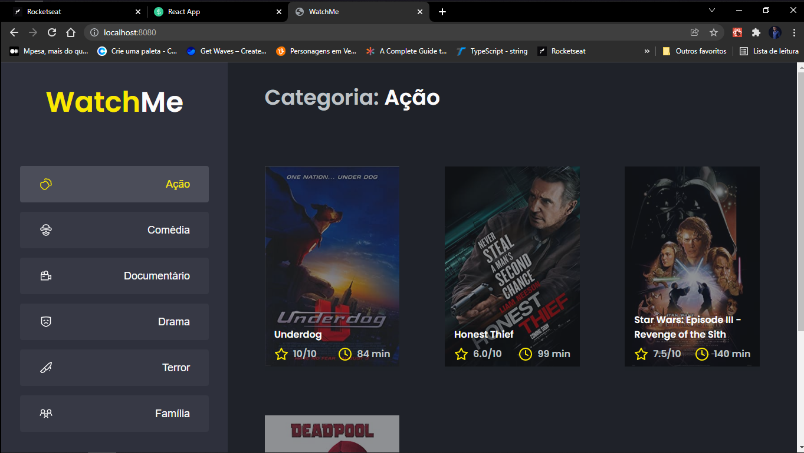

# WatchMe - Desafio de componentização com ReactJS

Este desafio consistia em dividir a Barra Lateral e conteúdo do centro em componentes diferentes, o torna-se um pouco desafiador porque a barra lateral controla o conteúdo exibido através de um ID que deve ser compartilhado entre os componentes. Consegui resolver o desafio e caso você queira conferir, siga este passo a passo:

* Vá ao seu terminal, cole e execute o comando  ``git clone https://github.com/acrisiodejesus/igniteComponentChallenge.git``

* E em seguida instale as dependências do projecto com o comando `yarn`

* Em seguida inicie a fake api com o comando `yarn server`

* E dê início ao projecto com  comando `yarn dev`

